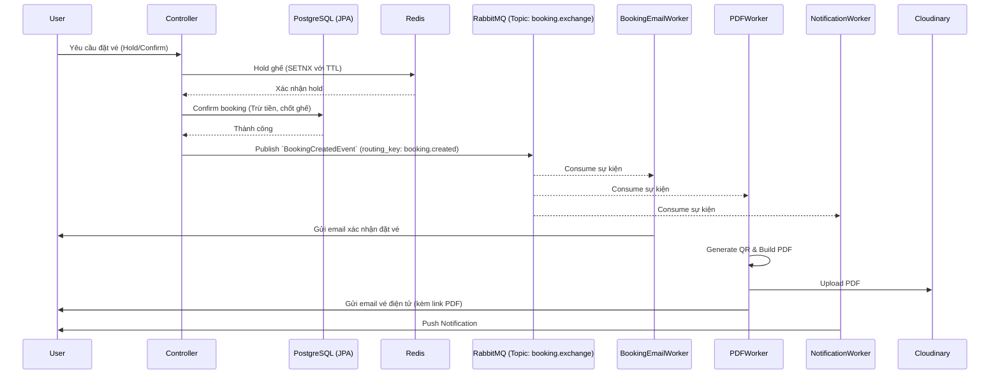

# Ticket Booking System

Hệ thống đặt vé (Ticket/Seat Booking System) được xây dựng dựa trên kiến trúc microservices/monolithic scaleable với khả năng xử lý concurrency cao. Ứng dụng tích hợp giữ chỗ qua Redis, xử lý logic bất đồng bộ bằng RabbitMQ và quản lý giao dịch an toàn với PostgreSQL.

## Tech Stack

| Thành phần | Công nghệ |
| :--- | :--- |
| **Backend** | Java 17, Spring Boot 3.3.0, Spring Data JPA, Spring Security, Spring Validation, Lombok |
| **Database** | PostgreSQL, Flyway (Database Migration) |
| **Cache/Queue** | Redis, RabbitMQ (Spring AMQP) |
| **Storage & Utils** | Cloudinary (Image & PDF Upload), ZXing 3.5.3 (QR Code), PDFBox 3.0.3 (PDF Generation) |
| **Security & Auth**| JWT (jjwt 0.11.5), Bucket4j (Rate Limiting) |
| **Documentation** | SpringDoc OpenAPI (Swagger UI) 2.6.0 |
| **Testing** | JUnit Jupiter, Testcontainers (PostgreSQL, RabbitMQ) |

## Kiến trúc tổng quan

Luồng đặt vé được thiết kế để chịu tải cao với cơ chế khóa lạc quan (optimistic locking) hoặc bi quan (pessimistic locking) thông qua Database, kết hợp với Redis để giữ chỗ (hold seat) tạm thời.

Sau khi thanh toán / confirm thành công, hệ thống sử dụng **RabbitMQ** để đẩy sự kiện (`BookingCreatedEvent`) vào một Topic Exchange (`booking.exchange`). Từ đây, nhiều worker (consumer) sẽ nhận sự kiện một cách song song để xử lý các nghiệp vụ phụ mà không chặn luồng chính:
- `BookingEmailWorker`: Gửi email xác nhận kèm thông tin cơ bản.
- `PDFWorker`: Tạo mã QR, nhúng vào file vé PDF, upload vé lên Cloudinary và gửi thêm email chứa link tải PDF.
- `NotificationWorker`: Xử lý thông báo (push notification) cho người dùng.



## Cấu trúc thư mục

```text
com.example.ticket
├── config       # Chứa các file cấu hình: Cache, Cloudinary, RabbitMQ, Redis, Security, Swagger, Web...
├── controller   # Các Rest Controller: Admin, Auth, Booking, Concert, Image, Payment, Seat, SeatHold
├── dto          # Data Transfer Objects cho Request và Response
├── entity       # JPA Entities: Booking, BookingSeat, Concert, Payment, Role, Seat, User
├── enums        # Khai báo enum cho trạng thái ghế, thanh toán...
├── event        # Domain events: BookingCreatedEvent, EmailEvent và EventPublisher
├── exception    # Xử lý ngoại lệ, GlobalExceptionHandler
├── mapper       # Class mapper (như MapStruct hoặc manual mapping)
├── repository   # JPA Repositories truy xuất dữ liệu
├── security     # Cấu hình JWT filter, UserDetailsService, Auth...
├── service      # Logic nghiệp vụ: AuthService, BookingService, ConcertService, EmailService...
├── util         # Tiện ích: DateTimeFormatUtil, QrCodeGenerator, TicketPdfGenerator
└── worker       # Các RabbitMQ Consumer: BookingEmail, OtpEmail, PDF, Notification, DLQMonitor
```

## Các chức năng chính

- **Authentication & Authorization**: Hệ thống đăng ký, đăng nhập với JWT. Quản lý phân quyền với Spring Security (USER, ADMIN, VIP). Có tích hợp gửi OTP qua email (sử dụng luồng RabbitMQ riêng `otp.exchange`).
- **Seat hold & Booking**: Cơ chế hold ghế bằng Redis đảm bảo không trùng lặp (tránh Race Condition) thông qua TTL. Đặt vé hỗ trợ cả `optimistic locking` và `pessimistic locking`.
- **Payment**: Thanh toán đặt chỗ (mock pay). Quản lý giao dịch và trạng thái thanh toán.
- **Email notification**: 
  - **Luồng OTP**: Gửi mã OTP xác thực (RabbitMQ `otp.exchange` -> `otp.email.queue` -> `OtpEmailWorker`).
  - **Luồng Đặt vé**: Gửi xác nhận đặt chỗ (RabbitMQ `booking.exchange` -> `booking.queue` -> `BookingEmailWorker`).
- **PDF Ticket Generation**: Sau khi booking hoàn tất, hệ thống chạy background worker sinh mã QR (dùng ZXing) và vẽ file vé PDF (dùng PDFBox khổ giấy A5), sau đó upload lên Cloudinary và trả URL cho khách hàng.
- **DLQ & Retry Mechanism**: Các Consumer được cấu hình tự động retry 3 lần, nếu thất bại sẽ chuyển message vào Dead-Letter-Exchange (`dlx.exchange`) và giữ tại `booking.dlq` để `DLQMonitor` log lỗi, cảnh báo.

## RabbitMQ Architecture

Dựa theo `RabbitMQConfig.java`, hệ thống được thiết kế theo mô hình sau:

| Exchange | Loại | Queue | Routing Key | Consumer | Mục đích |
| :--- | :--- | :--- | :--- | :--- | :--- |
| `booking.exchange` | Topic | `booking.queue` | `booking.created` | `BookingEmailWorker` | Gửi email text/html xác nhận vé |
| `booking.exchange` | Topic | `pdf.queue` | `booking.created` | `PDFWorker` | Tạo QR, build PDF, upload Cloudinary và email vé PDF |
| `booking.exchange` | Topic | `notification.queue` | `booking.created` | `NotificationWorker` | Xử lý push notification (giả lập) |
| `otp.exchange` | Direct | `otp.email.queue` | `otp.sent` | `OtpEmailWorker` | Gửi email chứa mã xác thực OTP |
| `dlx.exchange` | Direct | `booking.dlq` | `booking.dlq` | `DLQMonitor` | Chứa các message xử lý lỗi quá 3 lần (Retry Dead-Letter) |

## API Endpoints

| Method | Path | Mô tả | 
| :--- | :--- | :--- | 
| `POST` | `/api/auth/register` | Đăng ký tài khoản |
| `POST` | `/api/auth/verify` | Xác nhận tài khoản / OTP |
| `POST` | `/api/auth/login` | Đăng nhập lấy JWT |
| `POST` | `/api/auth/refresh` | Làm mới JWT token |
| `POST` | `/api/auth/logout` | Đăng xuất |
| `GET` | `/api/admin/users` | (Admin) Lấy danh sách users |
| `DELETE` | `/api/admin/users/{id}` | (Admin) Xóa user |
| `PUT` | `/api/admin/users/{id}/role` | (Admin) Cập nhật role của user |
| `POST` | `/api/concerts` | Tạo mới sự kiện/concert |
| `GET` | `/api/concerts` | Danh sách sự kiện |
| `GET` | `/api/concerts/{id}` | Chi tiết một sự kiện |
| `PUT` | `/api/concerts/{id}` | Cập nhật sự kiện |
| `POST` | `/api/concerts/{concertId}/seats/generate`| Sinh danh sách ghế cho sự kiện |
| `GET` | `/api/concerts/{concertId}/seats`| Lấy danh sách ghế theo concert |
| `GET` | `/api/seats/{id}/hold-status` | Lấy trạng thái giữ (hold) của ghế |
| `POST` | `/api/seats/hold` | Thực hiện hold ghế bằng Redis |
| `POST` | `/api/bookings/optimistic` | Đặt vé bằng cơ chế optimistic locking |
| `POST` | `/api/bookings/pessimistic` | Đặt vé bằng cơ chế pessimistic locking |
| `POST` | `/api/bookings/confirm` | Xác nhận booking sau khi hold thành công |
| `POST` | `/api/payments` | Khởi tạo giao dịch thanh toán |
| `POST` | `/api/payments/{id}/mock-pay` | Thực hiện thanh toán giả lập (mock pay) |
| `GET` | `/api/payments/{id}` | Lấy chi tiết thông tin thanh toán |
| `POST` | `/api/images/upload` | Upload ảnh (multipart form) |

## Cách chạy project

### Yêu cầu môi trường
- Java 17
- Maven
- Docker & Docker Compose

### Thiết lập biến môi trường
Tạo file `.env` tại thư mục root (chứa `docker-compose.yml`) với mẫu sau:
```env
# Postgres
POSTGRES_USER=ticket_user
POSTGRES_PASSWORD=your_db_password
POSTGRES_DB=ticket_db
POSTGRES_PORT=5432

# Redis
REDIS_PORT=6379

# RabbitMQ
RABBITMQ_USER=ticket_user
RABBITMQ_PASSWORD=your_rabbit_password
RABBITMQ_PORT=5672

# Mail
MAIL_USERNAME=your_email@gmail.com
MAIL_PASSWORD=your_app_password

# JWT
JWT_SECRET=your_jwt_secret_key
```

### Khởi chạy dịch vụ Infrastructure (PostgreSQL, Redis, RabbitMQ)
```bash
docker-compose up -d
```

### Chạy ứng dụng Spring Boot
Build và khởi động bằng Maven:
```bash
mvn clean package -DskipTests
java -jar target/ticket-0.0.1-SNAPSHOT.jar
```
_Lưu ý: Flyway sẽ tự động chạy migration để tạo schema và data mẫu._

## Database Schema

Database được thiết kế dựa trên PostgreSQL, các bảng chính bao gồm:
- **`users` / `roles` / `user_roles`**: Lưu trữ thông tin tài khoản, mật khẩu, email và quản lý Role (USER, ADMIN, VIP).
- **`concerts`**: Lưu sự kiện âm nhạc (tên, mô tả, ngày giờ, số lượng ghế trống, giá).
- **`seats`**: Danh sách chi tiết từng ghế tham chiếu theo `concert_id`.
- **`bookings` / `booking_seats`**: Thông tin các lần đặt chỗ thành công của người dùng, liên kết trực tiếp với các ghế đã chốt.
- **`payments` / `payment_seats`**: Lưu trữ giao dịch thanh toán tạm thời (`hold_id`), số tiền, trạng thái thanh toán (`transaction_id`) và lịch sử ngày tạo.

## Known Limitations / TODO
- **PDF Encoding (Tiếng Việt)**: Thư viện sinh PDF (`PDFBox` với font chuẩn `Standard14Fonts.FontName.HELVETICA`) chưa cấu hình font hỗ trợ ký tự Tiếng Việt (Unicode). Do đó, hiện tại mọi chuỗi ký tự chứa dấu đang phải chạy qua util `removeAccents` (loại bỏ dấu) trước khi chèn vào trang để không bị lỗi font khi xuất PDF. TODO: Chuyển qua sử dụng TrueType Font (TTF) để render chuẩn Tiếng Việt.
- **Giả lập tính năng**: Dịch vụ thanh toán (mock-pay) và Push Notification hiện chỉ mô phỏng (dùng `Thread.sleep` làm thời gian trễ), chưa tích hợp gateway thật (như VNPay, Momo hay Firebase Cloud Messaging).
