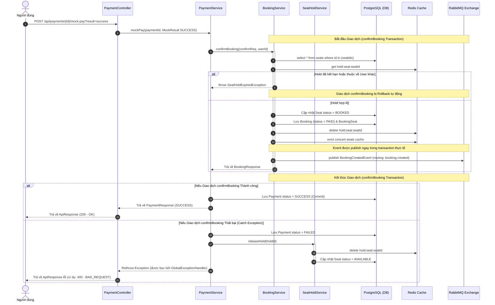

# Sơ đồ Hoạt động & Kiến trúc Hệ thống Ticket Booking

Tài liệu này mô tả chi tiết luồng nghiệp vụ từ bước chọn ghế, giữ ghế, thanh toán giả lập đến xử lý bất đồng bộ sau khi đặt vé thành công. Sơ đồ được xây dựng dựa trên khảo sát thực tế toàn bộ source code của dự án.

---

## 1. Luồng Tổng Quan Hệ Thống (Flowchart)

Sơ đồ dưới đây thể hiện toàn bộ quy trình từ Client, cơ sở dữ liệu PostgreSQL, bộ nhớ tạm Redis và hệ thống tin nhắn RabbitMQ.

```mermaid
flowchart TD
    Client([Client / Người dùng]) -->|1. Đăng nhập & Chọn ghế| Auth[Authentication]
    Auth -->|2. Giữ ghế /api/seats/hold| HoldController[SeatHoldController]
    
    subgraph Giữ Ghế (Hold Seats)
        HoldController -->|SETNX hold:seat:seatId| RedisHold{Redis Hold?}
        RedisHold -- SUCCESS -->|Set Seat = HOLD, holdExpiresAt = 5p| DB_Seat[(PostgreSQL: seats)]
        RedisHold -- FAIL -->|Trả lỗi: Ghế đã bị giữ| Client
    end

    Client -->|3. Tạo thanh toán /api/payments| PayController[PaymentController]

    subgraph Tạo Thanh Toán (Create Payment)
        PayController -->|Kiểm tra key hold:seat:seatId| RedisCheck{Redis hold còn hạn?}
        RedisCheck -- NO -->|Ngoại lệ: Hold expired| Client
        RedisCheck -- YES -->|Lưu Payment status = PENDING, UUID tx| DB_Pay[(PostgreSQL: payments)]
    end

    Client -->|4. Thanh toán /api/payments/{id}/mock-pay?result=success| MockPay[Mock Payment Flow]

    subgraph Giả Lập Thanh Toán (Mock Payment)
        MockPay -->|result = fail| PayFail[Xử lý Thanh Toán Thất Bại]
        MockPay -->|result = success| ConfirmBooking[Gọi BookingService.confirmBooking]
        
        ConfirmBooking -->|Thành công| PaySuccess[Cập nhật Payment status = SUCCESS]
        ConfirmBooking -->|Thất bại / Exception| PayFail
        
        PayFail -->|Cập nhật Payment status = FAILED| DB_Pay
        PayFail -->|Xóa key hold & revert Seat = AVAILABLE| ReleaseHold[SeatHoldService.releaseHold]
    end

    subgraph Giao Dịch Đặt Vé (confirmBooking Transaction)
        ConfirmBooking -->|Kiểm tra Redis hold & DB status| VerifyHold{Hold hợp lệ?}
        VerifyHold -- NO -->|Ngoại lệ: Hold expired/invalid| Rollback[Rollback Transaction & ném Exception]
        VerifyHold -- YES -->|Revert Seat = BOOKED| DB_Seat
        VerifyHold -->|Tạo Booking status = PAID| DB_Booking[(PostgreSQL: bookings)]
        VerifyHold -->|Xóa Redis hold keys| RedisDelete[(Redis Hold keys)]
        VerifyHold -->|Xóa Cache ghế| CacheEvict[(Cache: concert-seats)]
        VerifyHold -->|Publish BookingCreatedEvent| RabbitMQ[RabbitMQ: booking.exchange]
    end

    subgraph Xử lý Bất Đồng Bộ (Async Workers)
        RabbitMQ -->|Queue: booking.queue| EmailWorker[EmailWorker]
        RabbitMQ -->|Queue: pdf.queue| PDFWorker[PDFWorker]
        RabbitMQ -->|Queue: notification.queue| NotificationWorker[NotificationWorker]
        
        EmailWorker -->|Gửi Email Confirmation| Client
        PDFWorker -->|Tạo tệp PDF vé| Client
        NotificationWorker -->|Gửi Push Notification| Client
    end
```

---

## 2. Sơ đồ Tuần tự Tiến trình confirmBooking (Sequence Diagram)

Sơ đồ thể hiện chi tiết ranh giới giao dịch (transactional boundary) của phương thức `confirmBooking` và cách hệ thống xử lý khi có lỗi xảy ra.



---

## 3. Ghi Chú Điểm Khác Biệt Giữa Code Thực Tế & Thiết Kế Ban Đầu

Trong quá trình triển khai và đối chiếu mã nguồn thực tế của repository, có một số điểm khác biệt lớn cần lưu ý so với tài liệu lý thuyết ban đầu:

### 1. Đồng bộ hóa Xử lý Giữ nhiều ghế (Multi-seat vs Single-seat Payment)
* **Thiết kế ban đầu:** Yêu cầu luồng tạo thanh toán (`PaymentCreateRequest`) hỗ trợ một mảng các ghế (`seatIds[]`) và thực thể `Payment` liên kết qua bảng trung gian `PaymentSeat`.
* **Thực tế mã nguồn dự án:**
  * Thực thể `Payment` và DTO `PaymentCreateRequest`/`PaymentResponse` hiện tại chỉ lưu trữ thông tin của một ghế đơn lẻ (`seatId` dạng `Long`, `holdId` dạng `String`).
  * Tuy nhiên, các service hạ tầng giữ ghế (`SeatService.holdSeats`) và xác nhận đặt vé (`BookingService.confirmBooking`) đều được thiết kế đầy đủ để xử lý hàng loạt nhiều ghế cùng lúc (`List<Long> seatIds`).

### 2. Luồng Xuất Bản Sự Kiện RabbitMQ (Event Publication Boundary)
* **Thiết kế ban đầu:** Sự kiện `booking.created` được publish bất đồng bộ sau khi transaction xác nhận đặt vé đã được commit thành công (sử dụng `@TransactionalEventListener(phase = AFTER_COMMIT)`).
* **Thực tế mã nguồn dự án:**
  * Method `BookingService.createBookingOptimistic` thực hiện publish event trực tiếp thông qua `rabbitTemplate.convertAndSend` ngay bên trong thân method có annotation `@Transactional`.
  * Việc này đồng nghĩa với việc event sẽ được đẩy lên RabbitMQ ngay lập tức, trước khi transaction tại cơ sở dữ liệu thực sự commit hoàn tất.
